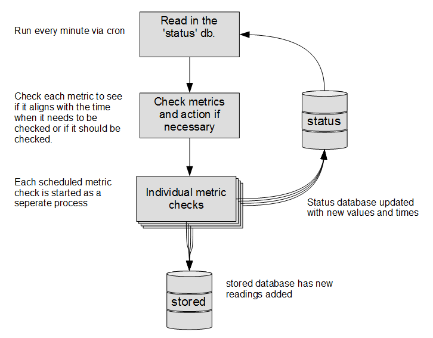
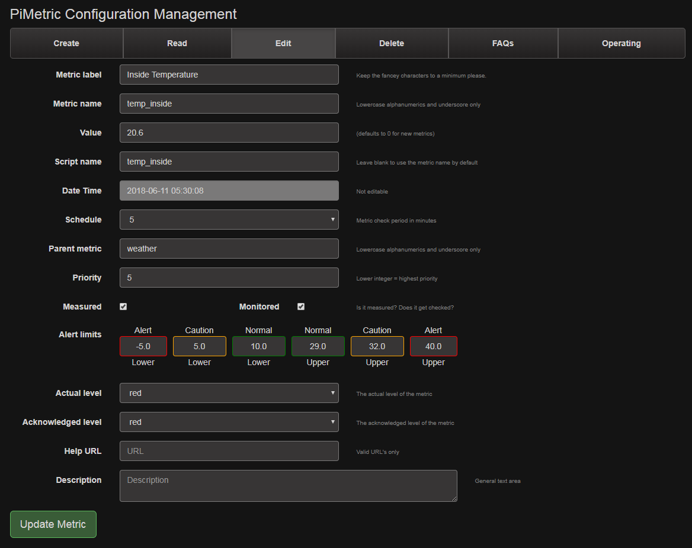
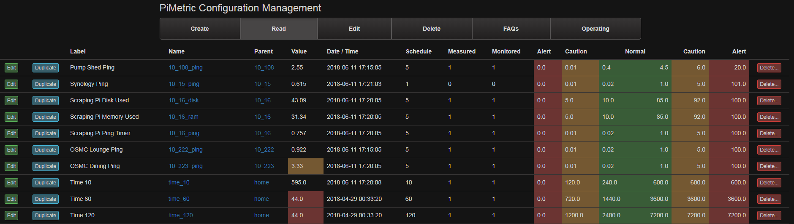
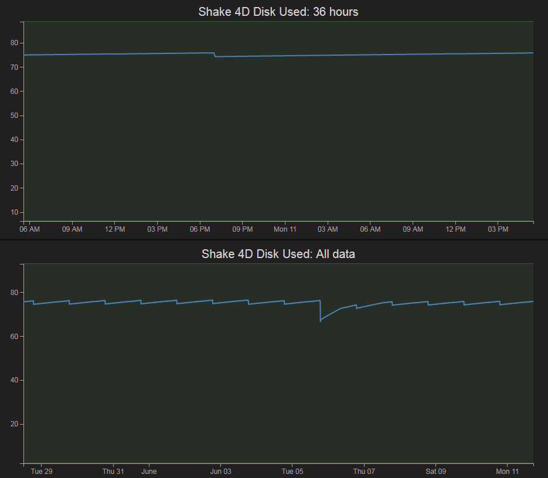
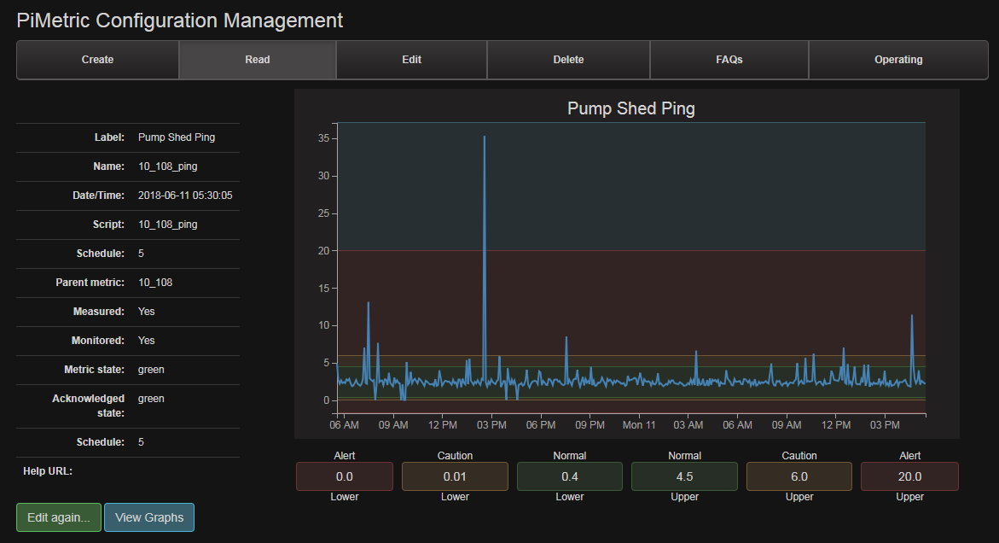

# PiMetric

A monitoring system for infrastructure and services 

## Overview

PiMetric carries out regular checks on hardware and software services. It runs on a Raspberry Pi, but there is no reason why it couldn't scale up for larger installations.

It uses the concept of 'metrics'. Each 'metric' has a measurable value which is recorded and evaluated for correct operation.

Examples of the type of metrics include;

- Data pulled from SNMP requests (hard drive space, memory, CPU load)
- Information scraped from a web page.
- Values parsed from a text file (logs)
- HTTP RESTful/API queries (via Nagios, bespoke systems, external providers)
- Database content

## Structure

The project is roughly divided into three parts. The measurement core, the management interface and the operating layer.

### Measurement

The measurement core focuses on getting information and recording it.

It utilities separate processes to gather data in a programmatic way via Python based data gathering modules. These processes store measured values in a SQLite database. It contains a table for stored metric values and a table for the configuration.

The metrics can be arranged in a hierarchy.  This is a tree structure to create greater context for evaluation.

The processes are individually scheduled and run via a cron job.

### Management

The management is carried out using a simple CRUD system. This provides the ability create, edit, delete and view the metric information. While it is not intended to be a operational interface, it shares some features of one. 

The management system includes logging, validation and sanitization. This maintains the integrity of the SQLite database and the structure of the metrics. 

It is built from HTML, PHP and JavaScript, using a lightly modified Bootstrap front end and some d3.js graphing components.

### Operating

The operating layer provides an end user with the ability to explore the monitoring environment and the values that it has collected.

It is designed to display information in different ways depending on the role or end use of the data. For example, a 'weather' role might include information from a local weather station and external services. Whereas a 'network' function might include data rates, access availability, ping delays.

The way that it displays information is designed to allow an overview of what metrics are being measured in context with their roles. The user can also drill into the data and discover information that is useful to them. 

It is also designed to respond to alerts when the metrics exceed their stated operating parameters. This provides a mechanism to manage faults, error conditions and to aid troubleshooting.

Like the management layer, this part of the project uses HTML, PHP and JavaScript. Bootstrap is at the front end and d3.js looks after the graphing components
